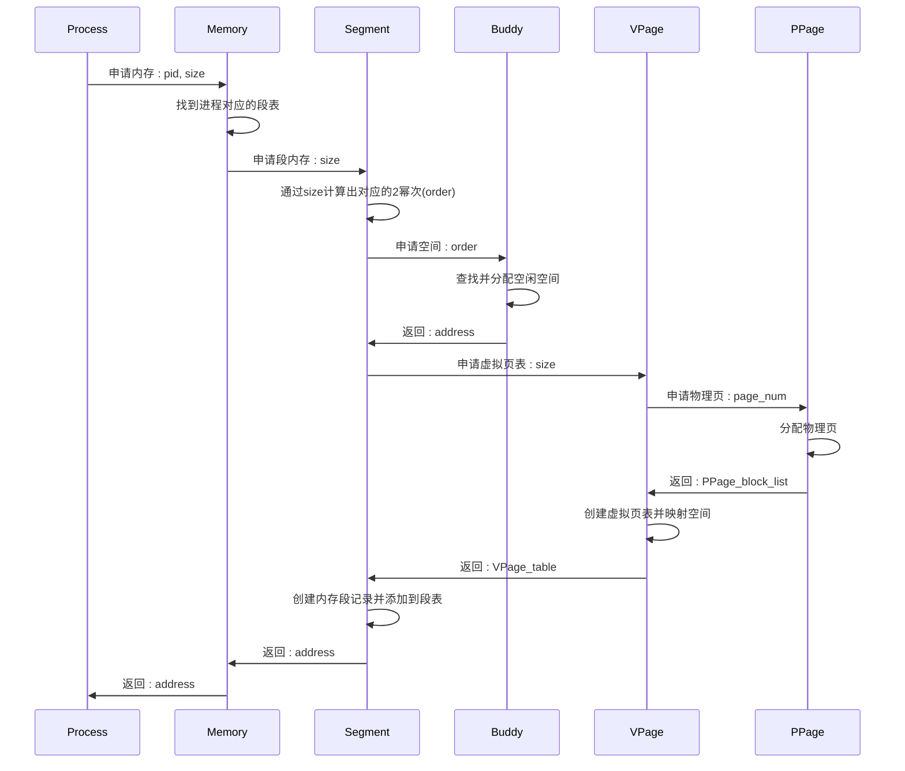

# MMU

## 介绍

这只是一个关于内存管理实验的代码。

大致分为5个模块：

+ 物理内存
+ 虚拟页表
+ 伙伴系统
+ 段页式内存
+ 多进程虚拟内存

其中主要的算法在于物理内存管理和伙伴系统部分，其他模块更多是用于抽象和封装。

最后封装的结果就是Memory模块，用于模拟多进程的内存管理。

## 内存申请时序图

```mermaid
sequenceDiagram
	Process ->> Memory : 申请内存 : pid, size

    Memory ->> Memory : 找到进程对应的段表

    Memory ->> Segment : 申请段内存 : size
    
    Segment ->> Segment : 通过size计算出对应的2幂次(order)

    Segment ->> Buddy : 申请空间 : order

    Buddy ->> Buddy : 查找并分配空闲空间

    Buddy ->> Segment : 返回 : address

    Segment ->> VPage : 申请虚拟页表 : size

    VPage ->> PPage : 申请物理页 : page_num

    PPage ->> PPage : 分配物理页

    PPage ->> VPage : 返回 : PPage_block_list

    VPage ->> VPage : 创建虚拟页表并映射空间

    VPage ->> Segment : 返回 : VPage_table

    Segment ->> Segment : 创建内存段记录并添加到段表

    Segment ->> Memory : 返回 : address

    Memory ->> Process : 返回 : address 
```